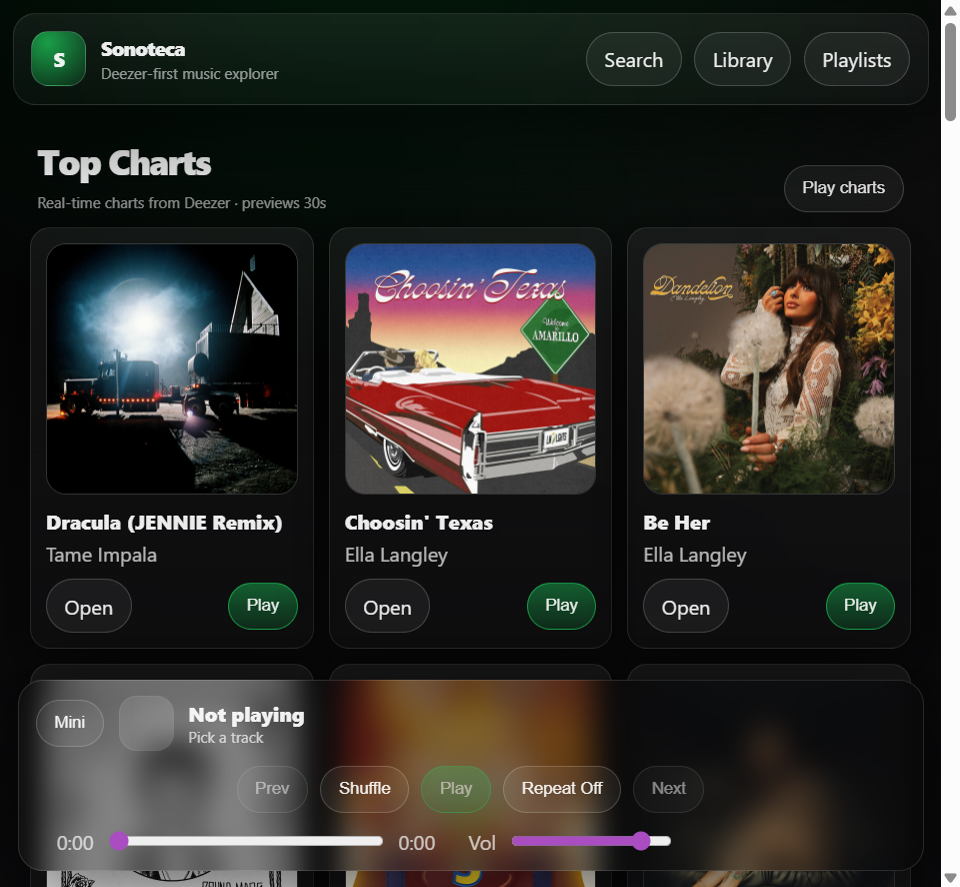

# Sonoteca — Music Library (FastAPI + React)

[](https://sonoteca-hzbi.vercel.app/)
[](https://github.com/Jorgeotero1998/Sonoteca/actions/workflows/ci.yml)
[](https://fastapi.tiangolo.com/)
[](https://react.dev/)
[](https://www.postgresql.org/)
[](https://www.typescriptlang.org/)
[](https://vercel.com/)

**Live:** [sonoteca-hzbi.vercel.app](https://sonoteca-hzbi.vercel.app/) · **Stack:** React + FastAPI + PostgreSQL (Neon) on Vercel

<p align="center">
  <a href="https://sonoteca-hzbi.vercel.app/">
    
  </a>
  <br/>
  <sub><i>Live app — Deezer-powered Top Charts with 30s previews and built-in player.</i></sub>
</p>


https://github.com/user-attachments/assets/51e454f5-8d8f-4d50-aeeb-a0a1c5c7dd3a


Production-grade music platform — real **Deezer API** catalog, 30s previews, JWT auth, RBAC, playlists, and listening history. Monorepo deployed as a single Vercel project (`/api` backend + React frontend). Refs-only persistence — no audio hosting.

```
┌─────────────┐     ┌──────────────────┐     ┌─────────────────────┐     ┌──────────────┐
│ React (Vite)│────▶│ FastAPI  /api    │────▶│ SQLAlchemy + Alembic│────▶│ Neon Postgres│
│  TypeScript │     │ JWT · RBAC · API │     │   asyncpg · PyJWT   │     │  refs-only   │
└─────────────┘     └────────┬─────────┘     └─────────────────────┘     └──────────────┘
                             │
                             ▼
                    ┌─────────────────┐
                    │   Deezer API    │
                    │ catalog · 30s   │
                    └─────────────────┘
```

## Case study

| | |
|---|---|
| **Problem** | Personal music library without hosting audio — browse, preview, and organize tracks from a real catalog with persistent user data. |
| **Solution** | React + FastAPI monorepo on Vercel: Deezer API for catalog/30s previews, Neon Postgres for refs-only storage, JWT + RBAC, built-in player with queue and playlists. |
| **Stack** | React · TypeScript · Vite · FastAPI · SQLAlchemy · Alembic · asyncpg · PostgreSQL (Neon) · Vercel |
| **Key decisions** | Refs-only persistence (no audio hosting) · Single Vercel deploy (`/` + `/api/*`) · Alembic migrations against Neon · Secrets in Vercel env vars |

## Key features

- Deezer-first browsing/search with **official 30s previews**
- **Real catalog data** (no mocks)
- Built-in preview **player** (play/pause, seek, volume, queue)
- Library tools: **favorites**, **history**, **library**, and **playlists**
- **Vercel all-in-one** fullstack deploy (React frontend + FastAPI API under `/api`)
- **Postgres (Neon-ready)** persistence with Alembic migrations

## Tech stack

- Frontend: React, TypeScript, Vite, React Router, Zustand, Framer Motion
- Backend: FastAPI, SQLAlchemy 2, Alembic, asyncpg, PyJWT, httpx
- Database: Postgres (Neon or any Postgres)
- Hosting: Vercel Services (monorepo), configured via `vercel.json`

## Monorepo structure

- `backend/` — FastAPI API
- `frontend/` — React (Vite) web app
- `vercel.json` — Vercel Services config (frontend + backend)

## Local development

### Option A: Docker Compose (recommended)

Requirements: Docker Desktop.

```bash
docker compose up --build
```

Services:

- Frontend: `http://localhost:5173`
- Backend: `http://localhost:8000` (health: `/health`, docs: `/docs`)
- Postgres: `localhost:5432`

Optional Redis:

```bash
docker compose --profile redis up --build
```

### Backend (FastAPI)

Requirements: Python 3.11+ and Postgres.

1) Create your env file:

```bash
cd backend
cp .env.example .env
```

2) Create a virtualenv + install dependencies:

```bash
python -m venv .venv
# Windows (PowerShell)
.\.venv\Scripts\Activate.ps1
# macOS/Linux
# source .venv/bin/activate

pip install -r requirements.txt
```

3) Ensure `DATABASE_URL` points to a Postgres instance (local or Neon) and run migrations:

```bash
alembic upgrade head
```

4) Start the API:

```bash
uvicorn app.main:app --reload --port 8000
```

API:
- `http://localhost:8000/health`
- `http://localhost:8000/docs`

### Frontend (React)

```bash
cd frontend
npm install
# Optional (defaults to http://localhost:8000 in dev):
cp .env.example .env

npm run dev
```

Web:
- `http://localhost:5173`

## Deployment (Vercel all-in-one)

This repo is set up to deploy as **one Vercel project** (frontend + backend) using `vercel.json`.

### 1) Create the Vercel project

- Import the Git repo in Vercel and select the **repo root**.
- The backend is served under `/api/*` and the frontend is served at `/`.

### 2) Provision Postgres (Neon)

- Create a Postgres database in Neon.
- Set `DATABASE_URL` in Vercel to your Neon connection string.

Notes:
- `postgres://` / `postgresql://` URLs are supported; the backend normalizes them for asyncpg.
- If your provider includes query params like `sslmode=require`, the backend handles them.

### 3) Set environment variables (Vercel → Project → Settings → Environment Variables)

Required:
- `DATABASE_URL`
- `JWT_SECRET` (use a long random value; rotate if ever exposed)
- `CORS_ORIGINS` (e.g. `https://sonoteca-hzbi.vercel.app`)

Catalog providers:
- `DEEZER_BASE_URL` (optional, default `https://api.deezer.com`)
- `SPOTIFY_CLIENT_ID` (optional)
- `SPOTIFY_CLIENT_SECRET` (optional)

### 4) Run migrations (manual)

Run Alembic migrations from your machine (or a one-off CI job) against the same `DATABASE_URL`:

```bash
cd backend
alembic upgrade head
```

### 5) Verify

- Frontend: `https://sonoteca-hzbi.vercel.app/`
- Backend health: `https://sonoteca-hzbi.vercel.app/api/health`
- OpenAPI: `https://sonoteca-hzbi.vercel.app/api/docs`

## Security

- Keep secrets out of git (use `.env` locally and Vercel env vars in production).
- If you have ever shared/deployed this repo publicly, **rotate your DB credentials and `JWT_SECRET`**.
